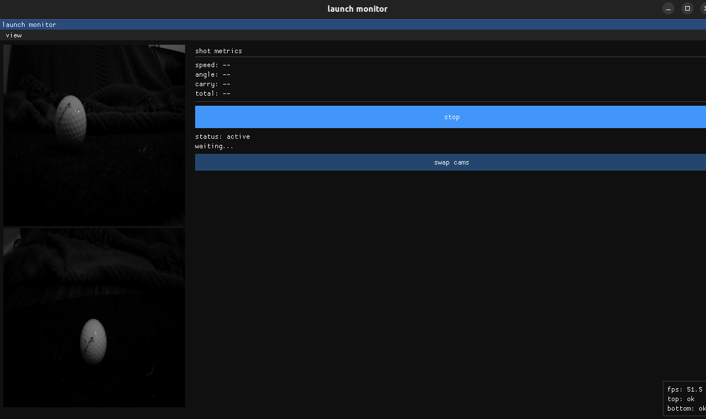
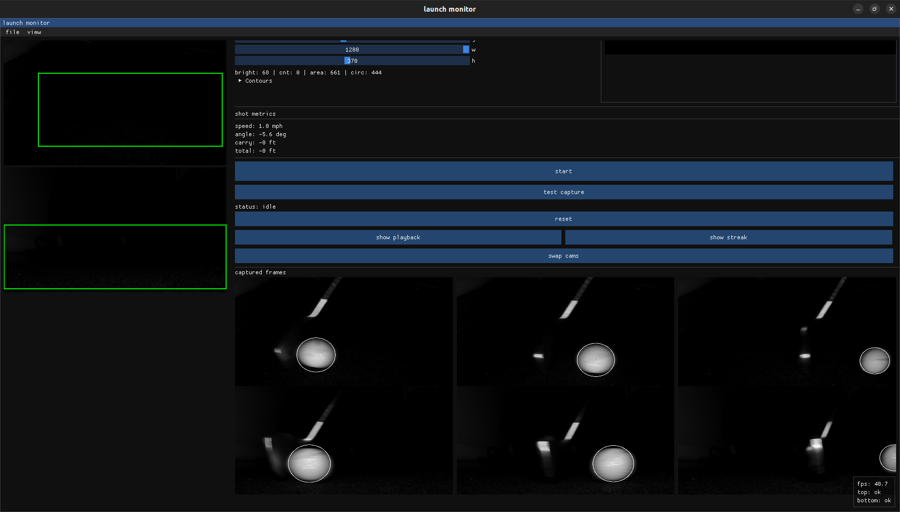

<p float="left">
  
  
</p>

## UPDATE

- currently working on strobing IR in frame instead of continuos capture - hopefully stop blurry frames
- with low fps cameras, we can sync the camera exposure to freeze the motion
- need to research led driver circuits and modules
- changing IR light, ~730nm seems to be the sweet spot


Tracks golf ball speed, launch angle, and estimated carry distance using two vertically-stacked cameras with IR illumination. When a ball passes through the detection zone, the system captures burst frames and calculates metrics based on timing and position changes

## My Hardware

- 2x Innomaker USB cameras (1280x720 @ 120fps, global shutter, monochrome)
- IR light for ball illumination
- Cameras mounted 5 inches apart vertically in a case - 2 angles of ball, top down & adjacent

Build & Run

```bash
cd launch-monitor/build
make -j4
./launch_monitor
```

Controls

- **View menu**: Toggle overlay, detection visualization, flip cameras
- **Start/Stop**: Begin/end monitoring mode
- **Swap Cameras**: Fix camera order if they enumerate wrong
- **Reset**: Clear shot data

What works

- Dual camera capture at 120fps
- Motion detection triggers burst capture
- Ball detection using brightness threshold + circularity filtering
- Speed calculation from inter-camera timing
- Launch angle estimation from position tracking
- Live visualization of detected balls
- 3 frame thumbnails from each shot

Issues & TODO

Current problems:
- Cameras have narrow FOV - ball needs to be pretty close to the monitor
- IR lighting needs to be stronger/better positioned for consistent detection
- Detection threshold (200 brightness) may need tuning based on lighting conditions
- Frame rate caps out at 120fps which is decent but higher would be better for accuracy

Need to do:
- Better IR lighting setup
- Spin detection (would need to see ball dimples/markings)
- Save/load camera settings so you don't have to flip/swap every time
- Better distance calculation 
